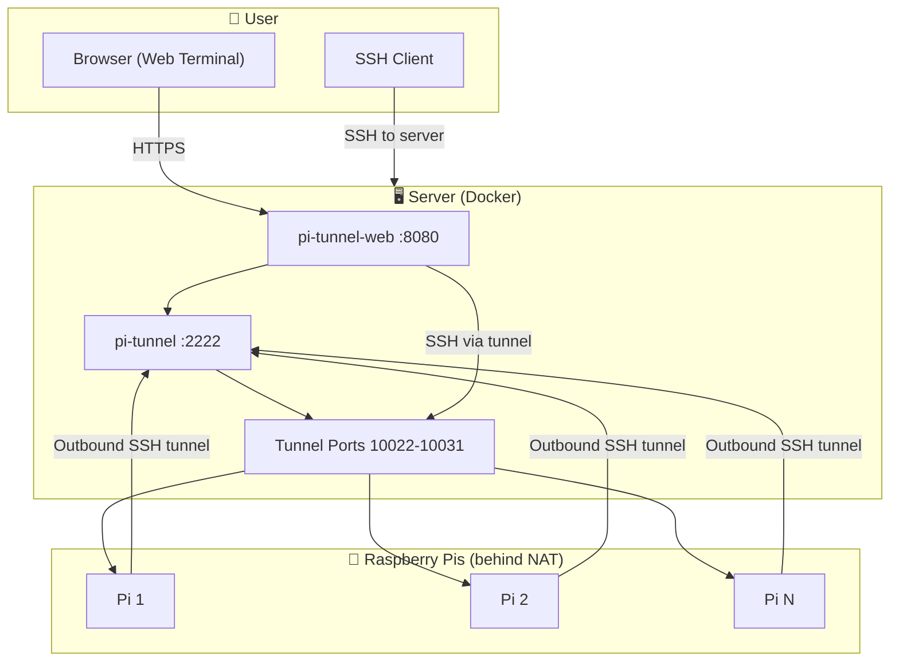

# Pi Remote Access

Control one or more Raspberry Pis remotely via reverse SSH tunnels. The Pi connects out to your server (works behind NAT); you SSH to the server, then connect to any Pi through the tunnel.

## Architecture



## How It Works

- **Raspberry Pi** (behind NAT): Opens an outbound SSH tunnel to your server. No port forwarding on your router.
- **Server** (static IP): Accepts tunnels and forwards them. You SSH to the server, then `ssh -p PORT user@localhost` to reach a Pi.
- **Web UI**: Create Pis, get unique registration URLs, run a script on each Pi to generate keys and configure the tunnel, and connect via a browser terminal.

## Prerequisites

- A server with a static IP (or hostname)
- Raspberry Pi(s) with internet access
- Docker and Docker Compose on the server

## Quick Start

### 1. Deploy on Your Server

```bash
git clone https://github.com/miladkhalafi/pi-remote-access.git
cd pi-remote-access
```

Copy `.env.example` to `.env` and fill in your values:

```bash
cp .env.example .env
# Edit .env: set SERVER_URL, SECRET_KEY, ADMIN_USERNAME, ADMIN_PASSWORD
```

Start the services:

```bash
docker compose up -d
```

This runs:
- **pi-tunnel-web** on port 8080 (web UI)
- **pi-tunnel** on port 2222 (SSH for Pi connections) and ports 10022–10031 (tunnel endpoints)

**First-time deployment:** The pi-tunnel container starts with an empty `authorized_keys` file. Create a Pi in the web UI, run the registration script on the Pi, and the tunnel will accept connections once the key is registered.

### 2. Configure the Web UI

1. Open `http://YOUR_SERVER:8080` (or your domain with reverse proxy).
2. The server public key is auto-populated when you mount the private key (see step 5). If auto-derivation fails (e.g. encrypted key), paste it manually in **Settings**. To generate a key:
   ```bash
   ssh-keygen -t ed25519 -N '' -f ~/.ssh/pi_shell_key
   cat ~/.ssh/pi_shell_key.pub
   ```
3. Click **Save** if you pasted manually.

### 3. Add a Raspberry Pi

1. In the web UI, enter a name (e.g. `pi-home`) and click **Create**.
2. Copy the registration URL (e.g. `https://your-server.com/register/abc123...`).

### 4. Register the Pi (Headless)

On the Raspberry Pi, run:

```bash
curl -sSL https://your-server.com/register/YOUR_TOKEN/script | bash
```

The script will:
- Generate an SSH key if needed
- Send the public key to the server
- Add the server's public key to the Pi's `authorized_keys`
- Install autossh and create a systemd service for the tunnel

**Headless mode:** When `SERVER_URL` is set on the server, the script runs fully non-interactive with no prompts. The server host and SSH port (2222) are injected into the script.

### 5. Connect to the Pi

**Option A: Web terminal** (recommended)

1. Mount your SSH private key for the web terminal (the public key is auto-derived and added to Settings):
   ```bash
   mkdir -p keys
   cp ~/.ssh/pi_shell_key keys/id_ed25519
   chmod 600 keys/id_ed25519
   ```
2. In the dashboard, click **Connect** next to a registered Pi.
3. A browser terminal opens; you get a shell on the Pi.

**Option B: SSH from server**

1. SSH to your server.
2. Run:

```bash
ssh -p 10022 pi@localhost
```

Use the port shown in the web UI for that Pi. Replace `pi` with the username on the Pi if different.

## Environment Variables

| Variable | Description | Default |
|----------|-------------|---------|
| `SERVER_URL` | Base URL for registration links and tunnel target (e.g. `https://your-server.com`). Required for headless registration | Request host |
| `SECRET_KEY` | Flask secret key (set in production) | `change-me-in-production` |
| `ADMIN_USERNAME` | Admin login (HTTP Basic Auth). When set with `ADMIN_PASSWORD`, dashboard requires login | (none) |
| `ADMIN_PASSWORD` | Admin password. Set with `ADMIN_USERNAME` to enable auth | (none) |
| `SSH_PRIVATE_KEY_PATH` | Path to private key for web terminal (must match Settings public key) | `/app/.ssh/id_ed25519` |
| `SERVER_PUBLIC_KEY` | Server public key string (overrides auto-derivation from private key) | (none) |
| `SERVER_PUBLIC_KEY_PATH` | Path to `.pub` file when public key is elsewhere | (none) |
| `SSH_SERVER_PORT` | SSH port on server for Pi tunnel (injected into registration script) | `2222` |
| `SSH_HOST` | Hostname for tunnel container (Docker network) | `pi-tunnel` |
| `SSH_USERNAME` | Username on the Pi | `pi` |
| `PORT_START` | First tunnel port (ensure docker-compose exposes the range) | `10022` |
| `PORT_COUNT` | Number of tunnel ports | `10` |
| `IMAGE` | pi-tunnel-sshd Docker image | `ghcr.io/miladkhalafi/pi-tunnel-sshd:latest` |
| `WEB_IMAGE` | pi-tunnel-web Docker image | `ghcr.io/miladkhalafi/pi-tunnel-web:latest` |

## Ports

| Port | Service |
|------|---------|
| 8080 | Web UI |
| 2222 | SSH (Pi connects here) |
| 10022–10031 | Tunnel endpoints (one per Pi) |

## Building from Source

```bash
# Build both images
docker compose build

# Or build individually
docker build -t pi-tunnel-sshd ./pi-tunnel-sshd
docker build -t pi-tunnel-web ./pi-tunnel-web
```

## GitHub Actions

On push to `main`, the workflow builds and pushes both images to GitHub Container Registry:

- `ghcr.io/miladkhalafi/pi-tunnel-sshd:latest`
- `ghcr.io/miladkhalafi/pi-tunnel-web:latest`

## Security Notes

- Use SSH keys only; password auth is disabled
- Set `SECRET_KEY` in production
- Set `ADMIN_USERNAME` and `ADMIN_PASSWORD` to protect the dashboard
- Use HTTPS for the web UI (reverse proxy with nginx/Caddy)
- The registration token is the secret; anyone with the URL can register a Pi. Use a private network or restrict access to the web UI

## Troubleshooting

**Pi shows "Pending" after running the script**
- Ensure the server's public key is set in Settings
- Check that the Pi can reach the server (curl the registration URL)

**Web terminal shows "SSH private key not configured"**
- Create `keys/` directory and copy your private key as `keys/id_ed25519` (must match the public key in Settings)
- Ensure the key has correct permissions: `chmod 600 keys/id_ed25519`

**Cannot connect to Pi from server**
- Verify the tunnel is running: `systemctl status ssh-reverse-tunnel` on the Pi
- Check the port in the web UI matches the Pi's assigned port
- Ensure you're using the correct username (default: `pi`)

**Tunnel drops**
- autossh and systemd restart it automatically
- Check `journalctl -u ssh-reverse-tunnel -f` on the Pi for errors
