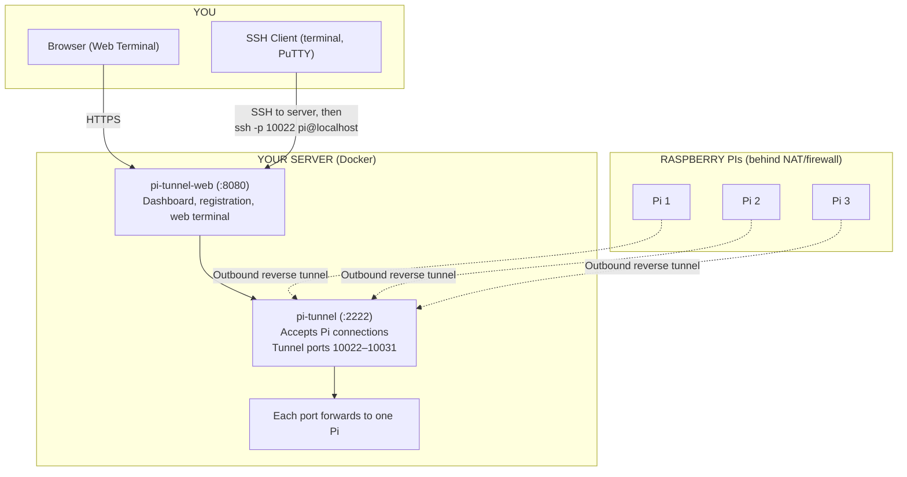

# Pi Tunnel

Remotely access Raspberry Pis over SSH, even when they're behind home/office firewalls (NAT). Each Pi opens an **outbound** connection to your server—no router port forwarding needed. You connect to the server, then reach any Pi through the tunnel.

## Architecture



**Flow summary:**
1. **Pis → Server:** Each Pi connects outbound to your server and creates a reverse tunnel (server port 10022+ → Pi’s SSH).
2. **You → Server:** Use the web UI or SSH into your server.
3. **You → Pi:** Connect via `localhost:PORT` (web or CLI). Traffic is forwarded through the tunnel to the Pi.

## How It Works

| Component | Role |
|-----------|------|
| **Raspberry Pi** (behind NAT) | Opens an outbound SSH tunnel to your server. No port forwarding required on your router. |
| **Server** (static IP) | Accepts tunnel connections and exposes a port per Pi. You SSH to the server, then run `ssh -p PORT user@localhost` to reach a Pi. |
| **Web UI** | Create Pis, get unique registration URLs, run a one-line script on each Pi to set up keys and the tunnel, and connect via a browser terminal. |

## Prerequisites

- **Server** with a static IP or hostname (VPS, cloud instance, or home server)
- **Raspberry Pi(s)** with internet access (can be behind NAT)
- **Docker & Docker Compose** installed on the server

## Quick Start

### 1. Deploy on Your Server

```bash
git clone https://github.com/miladkhalafi/pi-remote-access.git
cd pi-remote-access
```

Copy `.env.example` to `.env` and fill in your values:

```bash
cp .env.example .env
# Edit .env: set WEB_URL or SERVER_URL, SECRET_KEY, ADMIN_USERNAME, ADMIN_PASSWORD
```

Start the services:

```bash
docker compose up -d
```

This runs:
- **pi-tunnel-web** on port 8080 (dashboard, registration, web terminal)
- **pi-tunnel** on port 2222 (where Pis connect) and 10022–10031 (one port per Pi)

**First time:** The tunnel starts empty. Create a Pi in the web UI, run the registration script on that Pi, and the tunnel will accept connections once the key is registered.

### 2. Configure the Web UI

1. Open `http://YOUR_SERVER:8080` (or your domain with reverse proxy).
2. Log in with the credentials from `ADMIN_USERNAME` and `ADMIN_PASSWORD` (on first run, these create the first admin user).
3. On first run, an SSH key pair is auto-generated and the server public key is populated in **Settings**. Click **Save** to confirm. If you prefer your own key, mount `./keys` with `id_ed25519` and paste the public key manually.
4. Create additional users from **Users**: admins can add/viewers; viewers can only connect to Pis.

### 3. Add a Raspberry Pi

1. In the dashboard, enter a name (e.g. `pi-home`) and click **Create**.
2. Copy the **registration URL** shown for that Pi (e.g. `https://your-server.com/register/abc123...`).

### 4. Register the Pi (One-Time Setup)

On the Raspberry Pi, run:

```bash
curl -sSL https://your-server.com/register/YOUR_TOKEN/script | bash
```

The script will:
- Generate an SSH key on the Pi (if needed)
- Send the Pi's public key to the server
- Add the server's public key to the Pi's `authorized_keys`
- Install autossh and create a systemd service to keep the tunnel running

**Headless mode:** When `WEB_URL` or `SERVER_URL` is set, the script runs fully non-interactive (no prompts). The server host and port (2222) are injected automatically.

### 5. Connect to the Pi

**Option A: Web terminal** (recommended)

1. No extra setup—keys are auto-generated on first run (stored in `./data/.ssh/`).
2. In the dashboard, click **Connect** next to a registered Pi.
3. A browser terminal opens with a shell on the Pi.

To use your own SSH key, mount `./keys` with your `id_ed25519` and add the volume in docker-compose.

**Option B: SSH from your machine**

1. SSH to your server: `ssh user@your-server.com`
2. Then connect through the tunnel (use the port shown in the dashboard for that Pi):

```bash
ssh -p 10022 pi@localhost
```

Replace `pi` with the username on the Pi if different.

### 6. Uninstall (optional)

To remove the tunnel from a Pi, run on the Pi:

```bash
curl -sSL https://your-server.com/register/YOUR_TOKEN/uninstall-script | bash
```

This stops the tunnel service, unregisters the Pi from the server, and removes the server key from `authorized_keys`.

## Environment Variables

| Variable | Description | Default |
|----------|-------------|---------|
| `WEB_URL` | Dashboard base URL for registration links, script, API (e.g. `https://dashboard.example.com`) | `SERVER_URL` or request host |
| `SSH_TUNNEL_HOST` | Host where Pis connect for reverse SSH tunnel. Use when SSH runs on a different host than the web app | Host from `WEB_URL` |
| `SERVER_URL` | Legacy fallback for `WEB_URL` (e.g. `https://your-server.com`). Required for headless registration when `WEB_URL` not set | Request host |
| `SECRET_KEY` | Flask secret key (set in production) | `change-me-in-production` |
| `ADMIN_USERNAME` | First admin bootstrap. When set with `ADMIN_PASSWORD` and no users exist, creates the initial admin | (none) |
| `ADMIN_PASSWORD` | First admin password. Use with `ADMIN_USERNAME` to bootstrap; then create more users from the Users page | (none) |
| `SSH_PRIVATE_KEY_PATH` | Path to private key for web terminal (overrides auto-generated key in `./data/.ssh/`) | `/app/.ssh/id_ed25519` |
| `AUTO_GENERATE_KEYS` | Set to `false` to disable auto-generation (require manual key setup) | `true` |
| `SERVER_PUBLIC_KEY` | Server public key string (overrides auto-derivation from private key) | (none) |
| `SERVER_PUBLIC_KEY_PATH` | Path to `.pub` file when public key is elsewhere | (none) |
| `SSH_SERVER_PORT` | SSH port on server for Pi tunnel (injected into registration script) | `2222` |
| `SSH_HOST` | Hostname for tunnel container (Docker network) | `pi-tunnel` |
| `SSH_USERNAME` | Username on the Pi | `pi` |
| `PORT_START` | First tunnel port (ensure docker-compose exposes the range) | `10022` |
| `PORT_COUNT` | Number of tunnel ports | `10` |
| `IMAGE` | pi-tunnel-sshd Docker image | `ghcr.io/miladkhalafi/pi-tunnel-sshd:latest` |
| `WEB_IMAGE` | pi-tunnel-web Docker image | `ghcr.io/miladkhalafi/pi-tunnel-web:latest` |

## Ports

| Port | Purpose |
|------|---------|
| 8080 | Web dashboard (registration, web terminal) |
| 2222 | Pis connect here to establish reverse tunnels |
| 10022–10031 | Tunnel endpoints—each port maps to one Pi (used when connecting) |

## Separate Domains

You can serve the dashboard and the SSH tunnel from different hosts:

| Variable | Purpose |
|----------|---------|
| `WEB_URL` | Dashboard URL—registration links, script, and API |
| `SSH_TUNNEL_HOST` | Host where Pis connect for the tunnel (use when SSH runs elsewhere) |

**Same host** (default):

```
WEB_URL=https://dashboard.example.com
# SSH_TUNNEL_HOST not set — Pis use dashboard.example.com for the tunnel
```

**Different hosts** (e.g. SSH on dedicated server):

```
WEB_URL=https://dashboard.example.com
SSH_TUNNEL_HOST=ssh.example.com
```

Configure your reverse proxy so `dashboard.example.com` → pi-tunnel-web:8080, and `ssh.example.com:2222` → pi-tunnel:2222.

## Building from Source

```bash
# Build both images
docker compose build

# Or build individually
docker build -t pi-tunnel-sshd ./pi-tunnel-sshd
docker build -t pi-tunnel-web ./pi-tunnel-web
```

## GitHub Actions

On push to `main`, the workflow builds and pushes both images to GitHub Container Registry:

- `ghcr.io/miladkhalafi/pi-tunnel-sshd:latest`
- `ghcr.io/miladkhalafi/pi-tunnel-web:latest`

## Security Notes

- Use SSH keys only; password auth is disabled
- Set `SECRET_KEY` in production
- Set `ADMIN_USERNAME` and `ADMIN_PASSWORD` to bootstrap the first admin, then create users from the dashboard
- Use HTTPS for the web UI (reverse proxy with nginx/Caddy)
- The registration token is the secret; anyone with the URL can register a Pi. Use a private network or restrict access to the web UI
- **Roles**: Admin users can create/delete Pis, manage settings, and add users. Viewer users can only connect to Pis

## Troubleshooting

**Pi shows "Pending" after running the script**
- Ensure the server's public key is set in Settings
- Check that the Pi can reach the server (curl the registration URL)

**Web terminal shows "SSH private key not configured"**
- Keys are auto-generated on first run; ensure the `./data` volume is writable
- To use your own key: create `keys/` and copy your private key as `keys/id_ed25519`, then mount the volume in docker-compose

**Cannot connect to Pi from server**
- Verify the tunnel is running: `systemctl status ssh-reverse-tunnel` on the Pi
- Check the port in the web UI matches the Pi's assigned port
- Ensure you're using the correct username (default: `pi`)

**Tunnel drops**
- autossh and systemd restart it automatically
- Check `journalctl -u ssh-reverse-tunnel -f` on the Pi for errors

**Host key verification failed** (after server/container reboot)
- The SSH host keys were regenerated, so the Pi rejects the new key. Rebuild and redeploy to persist host keys (see docker-compose volume `./data/ssh_host_keys`).
- **Auto-resolve (recommended):** Re-run the registration script on the Pi. It now removes stale host keys and configures the tunnel to accept key changes automatically. If the Pi was registered before, just run the same curl command again.
- **Manual fix:** On the Pi, remove the old key and restart:
  ```bash
  ssh-keygen -f ~/.ssh/known_hosts -R '[YOUR_SSH_HOST]:2222'
  sudo systemctl restart ssh-reverse-tunnel.service
  ```
